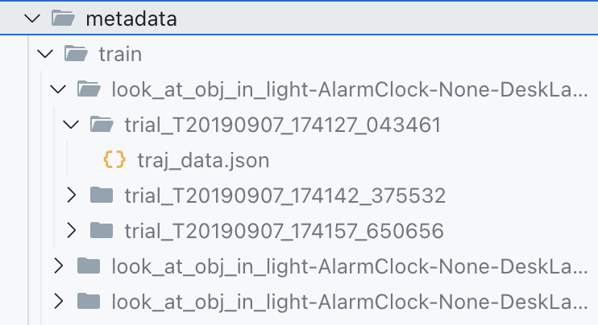

# Processing ALFRED for a VLM Benchmark

We used `notebook.py` to generate the virtual home dataset for ViSTa, our dataset for testing VLMs' understanding of sequential tasks. The `Task` class and the different functions could be repurposed to generate a custom dataset spliced from ALFRED's videos.

## How to use

1. Install the dependencies. We recommend using [uv](https://docs.astral.sh/uv/getting-started/installation/).
2. Download [ALFRED's videos and metadata](https://github.com/askforalfred/alfred/tree/master/data). Since you need the videos, you should get the Full version of the dataset (100+ GB).
3. Put the videos in `videos/` and the metadata in `metadata/`. This should leave you with a directory structure like this: 
4. Modify the parameters in `notebook.py` to generate the tasks you want. Alternatively, manually call the different functions from `src/alfred/task.py` to customize what tasks get generated.

## Notes

The code first loads the metadata and videos from ALFRED. The metadata contain things like the task name, the individual actions, their subactions, and the frames these correspond to. We package all of this into a `Trajectory` object that is easy to work with.

Then, we generate tasks (called _problem sets_ in the paper) by combining multiple trajectories and their descriptions. Before doing so, we will often isolate specific frames from the trajectories, add additional frames from other trajectories, or otherwise preprocess the trajectories.

The generated videos and tasks are in format that is expected by our evaluation code. The script `evaluation/convert.py` can be used to convert the videos and tasks to a more plain format, in case you want to run your own evaluation.
